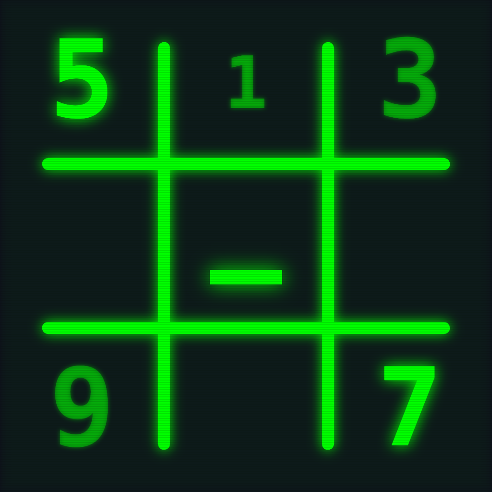

<p align="center">
  
</p>

# **SudoSodoku**

```
root@ios:~$ sudo sudosodoku breach --master
[sudo] password for logic: ********
> uniqueness_check ........ [OK]
> difficulty_index ........ 84
> ACCESS GRANTED
```

**`sudo solve` — logic is root access.**

SudoSodoku is the only sudoku on the App Store that treats you like root. It is a full terminal fantasy: green phosphor on deep dark glass, mechanical-keyboard haptics, and an ELO ladder that climbs from `SCRIPT_KIDDIE` to `THE_ARCHITECT`. You are not filling in numbers — you are breaching a grid, and every victory ends the only way it should: `ACCESS GRANTED`.

**📱 v2.0.0 · iOS 17.0+ · iPhone · App Store submission in progress**

## **🧠 Philosophy**

Four rules the whole game is built on:

1. **You're not filling numbers. You're breaching systems.**
   The terminal fantasy is total — the app is one continuous shell session. The landing prompt boots in on launch (`root@ios:~$ ` types `sudo sudosodoku` before your eyes), every screen is a subcommand picked from tab completion, puzzles generate behind a live breach log, victories detonate matrix rain, and rank-ups get a ceremony.

2. **Pure logic. Zero noise.**
   No ads. No lives. No pay-to-win. No guilt mechanics. No fail state — boards are finished or unfinished, never "lost". Even the timer is optional; nothing is allowed to interrupt a deduction.

3. **Earn your rank.**
   A real ELO system with anti-smurfing (top players gain nothing from stomping easy grids), Game Center leaderboards that rank actual performance — fastest solves and rating, never spending — and eleven achievements, one of them secret.

4. **Juice with respect.**
   Rigid-impact keystrokes, phosphor pulses, CRT-glitch error shakes — and every single animation respects Reduce Motion, sounds are never forced on. Delight is a layer, not a tax.

## **✨ Features**

### **🖥️ The Terminal**

* Authentic green phosphor on deep dark glass (`#0D121A`), all-monospaced UI — from the launch screen (which boots dark, never a white flash) to the last stat card
* **One accumulating command line**: `breach`, `archives`, `stats`, and `whoami` are subcommands typed into a live prompt; each destination echoes the full command it was reached with (`root@ios:~$ sudo sudosodoku breach --easy`)
* Typewriter **breach-log loading screen** whose verdict lines report the real uniqueness check and difficulty index of your puzzle
* Three-act **victory sequence**: Canvas-drawn matrix rain → typewriter `ACCESS GRANTED` → ELO ticker rolling to your new rating, with a glowing `>> RANK_UP <<` ceremony on tier crossings — and achievement unlocks rendered right inside it
* A semantic **haptic vocabulary**: cell selection ticks, rigid key-press placements, error notifications, and a custom CoreHaptics victory rumble
* A one-time surprise waiting in your first MASTER game

### **♾️ The Grid**

* Real-time procedural generation — unique-solution, human-gradable puzzles with a logical-solver difficulty score (0–100), never a canned database
* **Hand-crafted feel**: clue patterns follow varied aesthetic styles (rotational, mirror, diagonal, or deliberately free), and every difficulty has a technique identity — EASY always offers parallel simple moves and can never dead-end you, MEDIUM never demands more than locked candidates / naked pairs, HARD is designed around a fair intermediate "aha" and never requires guessing, MASTER resists intermediate techniques entirely
* Four difficulty flags: `--easy` `--medium` `--hard` `--master`
* Pencil notes with **auto-clear**: placing a digit sweeps it from peer notes, and undo restores everything as one compound move
* Numpad that thinks: exhausted digits strike through, dead taps nudge instead of being swallowed, the selection frame glides between cells
* Optional play clock (`T+MM:SS`) that only counts active time — backgrounding pauses it, victory freezes it

### **🏆 The Ladder**

* ELO rating from 1200 with adaptive K-factor and anti-smurfing
* Six ranks: `SCRIPT_KIDDIE` → `USER` → `SUDOER` → `SYS_ADMIN` → `KERNEL_HACKER` → `THE_ARCHITECT`
* **Game Center leaderboards**: a global ELO ranking plus fastest-time boards per difficulty (`cat /leaderboard`) — playable fully offline as a guest
* **Eleven achievements** (`HELLO_WORLD` … `THE_ARCHITECT`), all binary unlocks, one secret
* Honest statistics for a no-fail game (SOLVED / ELO / FASTEST / HARDEST — no fake "win rate"), personal bests, and full session archives where solved runs are immutable history: restarts fork a fresh attempt, viewing an old solution never rewrites it

## **🛠️ Technical Architecture**

* **Language**: Swift 5.9 · **UI**: SwiftUI · **Pattern**: MVVM · **State**: Combine
* **Platform**: iPhone-only, iOS 17.0+
* **Persistence**: single local JSON file, atomic writes, versioned migration chain — everything stays on device
* **Game services**: GameKit (optional auth, leaderboards, achievements) · CoreHaptics
* **Testing**: `SudoSodokuTests` unit suite (generator quality, rating, storage, record immutability, gameplay logic) run locally and on Xcode Cloud

### **Directory Structure**

```
SudoSodoku/
├── SudoSodokuApp.swift           # @main entry
├── Models/                       # GameRecord, SudokuCell, MoveHistory, Difficulty, RankTier, Achievement, ...
├── ViewModels/
│   └── SudokuGame.swift          # Core game logic, play clock, undo/redo, victory pipeline
├── Managers/
│   ├── GameCenterManager.swift   # Auth + leaderboard submissions
│   ├── AchievementManager.swift  # Unlock evaluation, local persistence, offline report queue
│   ├── RatingManager.swift       # ELO calculation
│   ├── HapticManager.swift       # Semantic haptic vocabulary (+ CoreHaptics victory)
│   ├── StatisticsManager.swift   # Stats aggregation
│   └── StorageManager.swift      # Atomic JSON persistence + migrations
├── Algorithms/
│   └── SudokuGenerator.swift     # Generation, uniqueness, technique tiers, difficulty grading
├── Utils/                        # AppConstants (leaderboard IDs), DateFormatting, ...
└── Views/
    ├── GameView.swift            # The board screen
    ├── LeaderboardView.swift     # Terminal-styled Game Center rankings
    ├── ...                       # Landing, Archive, Stats, Profile, ModeSelection
    └── Components/               # TerminalCommandComposer, BreachLogView, MatrixVictoryOverlay, ...

Config/Info.plist                 # Launch screen keys merged into the generated Info.plist
SudoSodokuTests/                  # Unit tests (picked up automatically by the shared scheme)
```

## **🚀 Building the Project**

### **Method 1: Using Xcode**

1. **Clone the repository**:

   ```bash
   git clone https://github.com/kaiiiichen/SudoSodoku.git
   ```

2. **Open in Xcode**:
   Double-click `SudoSodoku.xcodeproj`. Xcode 15.0+ required.

3. **Configure Signing**:
   Select the SudoSodoku target → **Signing & Capabilities** → set your own Team.

4. **Run**:
   Connect your iPhone or select a Simulator and press `Cmd + R`.

> ⚠️ If Xcode suggests "Update to recommended settings", decline the change that rewrites `IPHONEOS_DEPLOYMENT_TARGET` — it must stay the literal `17.0` (see [CONTRIBUTING.md](CONTRIBUTING.md)).

### **Method 2: Command Line**

* **`build.sh`** — build the project (like Xcode's Cmd+B)

  ```bash
  ./build.sh          # Debug build (default)
  ./build.sh release  # Release build
  ./build.sh clean    # Clean build artifacts
  ```

* **`play.sh`** — build and run in the iOS Simulator

  ```bash
  ./play.sh
  ```

* **Tests**:

  ```bash
  xcodebuild test -project SudoSodoku.xcodeproj -scheme SudoSodoku \
    -destination 'platform=iOS Simulator,name=iPhone 17 Pro'
  ```

### **Build Requirements**

* macOS 13.0+ · Xcode 15.0+ with Command Line Tools
* iOS 17.0+ deployment target · iPhone only

## **🤝 Contributing**

Contributions are welcome! Start with the [Contributing Guidelines](CONTRIBUTING.md) — they document this repo's actual workflow, not boilerplate:

* All changes go through feature branches and pull requests — never direct commits to `main`
* Conventional Commits, and `CHANGELOG.md` updated in the same PR
* The full test suite must pass before every PR; new generator/rating/storage logic needs matching unit tests
* iPhone-only scope: no iPad or macOS work
* UI copy speaks terminal (monospaced, `UPPER_SNAKE`, shell-flavored strings); every animation respects Reduce Motion, sounds are never forced on

Also see the [Code of Conduct](CODE_OF_CONDUCT.md) and issues labeled `good first issue`.

## **📚 Additional Documentation**

* **[CHANGELOG.md](CHANGELOG.md)** — Version history
* **[RELEASE_NOTES_v2.0.0.md](RELEASE_NOTES_v2.0.0.md)** — What shipped in 2.0
* **[DEVELOPER.md](DEVELOPER.md)** — Roadmap, testing checklist, and development guidelines
* **[CONTRIBUTING.md](CONTRIBUTING.md)** — How to contribute
* **[CODE_OF_CONDUCT.md](CODE_OF_CONDUCT.md)** — Community code of conduct
* **[SECURITY.md](.github/SECURITY.md)** — Security policy and vulnerability reporting
* **[PRIVACY.md](PRIVACY.md)** — Privacy policy (what data the app handles, and what never leaves the device)

## **🔒 Privacy**

Your data never leaves your device: game history, rating, and achievements live in a single local JSON file. There is no analytics, no tracking, and no account — Game Center sign-in is optional, operated by Apple, and only powers the leaderboards. Full details in the [privacy policy](PRIVACY.md) and the [security policy](.github/SECURITY.md).

## **📄 License**

Distributed under the MIT License. See LICENSE for more information.

*Created with logic and ❤️ by [Kai T. Chen](https://kaichen.dev) · [sudosodoku.kaichen.dev](https://sudosodoku.kaichen.dev)*
